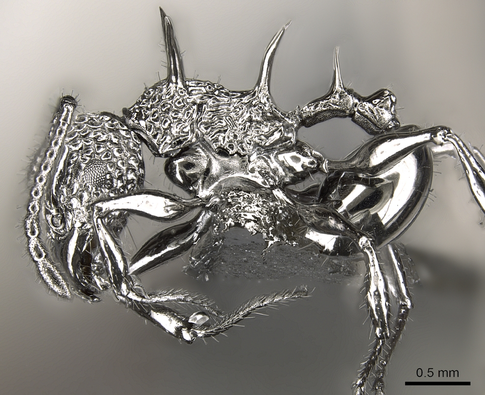

# tfcb-homework01
This project contains images, data, and source code for the first homeowork assignment. 
---

## images
[Images](images) in this project include:
- 
- 
- 
- 

## table example
| species                 | Description                   |
|-------------------------|-------------------------------|
| rhytidoponera_metallica | metalic ant                   |
| camponotus_darwinii     | hairy ant                     |
| acanthomyrmex_ferox     | ant under phase contrast?     |
| cataglyphis_forti       | normal looking ant            |

